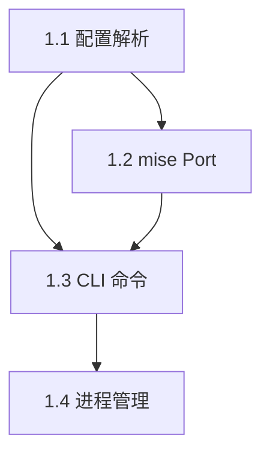
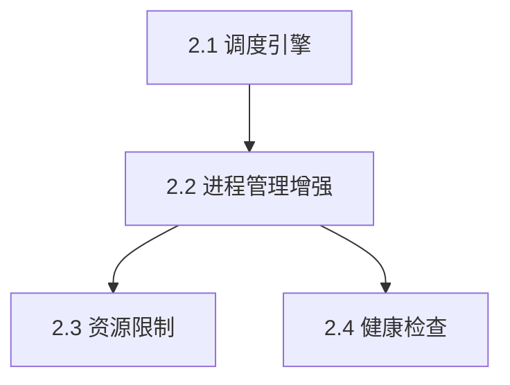
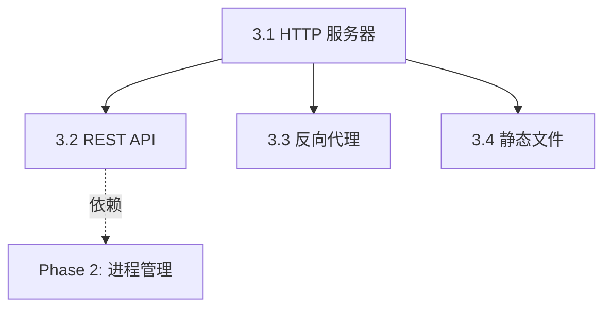
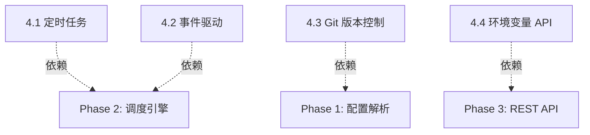
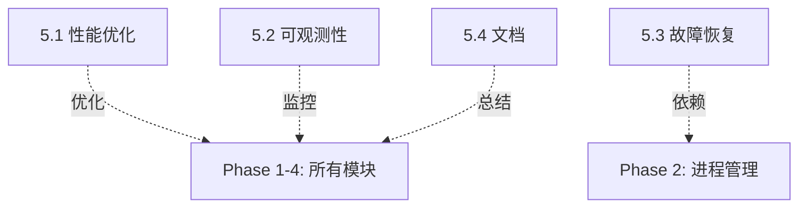

# 20. Implementation Phases - Phased Implementation Roadmap

## Design Goal

提供清晰的分阶段实现路线图,将 mise 重构设计从规范转化为可执行的开发计划。每个阶段定义明确的目标、交付物、依赖关系和验收标准,确保团队能够循序渐进地完成重构,最小化风险,同时保持系统可用性。

---

## Why This Design?

### 问题分析

1. **重构规模大**:从现有 systemd+cron 架构迁移到 mise+unified-scheduler 架构,涉及配置格式、进程管理、任务调度、API 设计等多个维度的变更
2. **风险难控制**:一次性重构容易引入大量 bug,且难以回滚,影响系统稳定性
3. **优先级不清晰**:缺乏明确的功能优先级划分,容易在次要功能上消耗过多时间
4. **依赖关系复杂**:各模块之间存在依赖,错误的实现顺序会导致返工
5. **验收标准缺失**:没有明确的完成标准,容易陷入"永远 90% 完成"的陷阱

### 解决方案

采用 **5 阶段渐进式实现策略**:

1. **Phase 1 - MVP 基础**:最小可用系统,验证核心架构可行性
2. **Phase 2 - 进程管理**:完善进程生命周期管理和资源限制
3. **Phase 3 - Web 服务**:实现 HTTP API 和内置反向代理
4. **Phase 4 - 高级特性**:添加定时任务、事件驱动、Git 版本控制等高级功能
5. **Phase 5 - 生产优化**:性能优化、可观测性、容错增强

每个阶段:
- **独立可用**:完成后即可部署使用,不依赖后续阶段
- **向后兼容**:新阶段不破坏已有功能
- **清晰验收**:明确的交付物和测试标准
- **风险可控**:问题在单阶段内隔离,易于回滚

---

## Phase Overview

| Phase | 名称 | 周期 | 核心目标 | 主要交付 |
|-------|------|------|----------|----------|
| **Phase 0** | 测试基础设施 | 1-2 周 | 建立测试框架 | MiseMock + FakeProcessManager + Fixtures + CI |
| **Phase 1** | MVP 基础 | 2-3 周 | 验证架构可行性 | 配置解析 + CLI + 基础服务管理 |
| **Phase 2** | 进程管理 | 2-3 周 | 完善进程生命周期 | 调度引擎 + 资源限制 + 健康检查 |
| **Phase 3** | Web 服务 | 2-3 周 | 实现 HTTP API | REST API + 内置反向代理 + 静态文件服务 |
| **Phase 4** | 高级特性 | 3-4 周 | 丰富调度能力 | 定时任务 + 事件驱动 + Git 版本控制 |
| **Phase 5** | 生产优化 | 2-3 周 | 生产级强化 | 性能优化 + 可观测性 + 故障恢复 |

**总周期预估**: 12-18 周（约 3-4.5 个月）

---

## Phase 0: 测试基础设施（1-2 周）

### 目标

建立完整的测试框架和 Mock 基础设施，为后续开发提供坚实的测试支持。确保所有核心模块（配置解析、mise 集成、进程管理）都有可靠的单元测试和集成测试基础。

### 核心交付物

#### 0.1 MiseMock 实现

**文件**: `tests/mocks/mise.rs`

**功能**:
- 模拟 mise CLI 行为（tools、env、tasks）
- 生成虚拟的 mise 配置文件
- 模拟 mise 命令执行结果
- 支持自定义工具版本和环境变量

**数据结构**:
```rust
pub struct MiseMock {
    /// 工具名称 -> 版本映射
    pub tools: HashMap<String, String>,
    /// 环境变量映射
    pub env: HashMap<String, String>,
    /// 任务名称 -> 任务定义映射
    pub tasks: HashMap<String, TaskDef>,
    /// 工作目录（用于生成 .mise.toml）
    pub workdir: PathBuf,
}

impl MiseMock {
    /// 创建新的 MiseMock 实例
    pub fn new(workdir: PathBuf) -> Self;
    
    /// 添加工具
    pub fn with_tool(mut self, name: &str, version: &str) -> Self;
    
    /// 添加环境变量
    pub fn with_env(mut self, key: &str, value: &str) -> Self;
    
    /// 添加任务定义
    pub fn with_task(mut self, name: &str, task: TaskDef) -> Self;
    
    /// 写入 mise 配置文件到 workdir
    pub fn write_config(&self) -> Result<()>;
    
    /// 模拟执行 mise 任务
    pub fn mock_exec(&self, task_name: &str) -> Result<Output>;
}

pub struct TaskDef {
    pub run: String,
    pub env: HashMap<String, String>,
    pub depends: Vec<String>,
}
```

**验收标准**:
- ✅ 能生成有效的 `.mise.toml` 配置文件
- ✅ 能模拟所有 mise CLI 操作（install、exec、env）
- ✅ 单元测试覆盖率 > 90%
- ✅ 支持嵌套任务依赖关系

---

#### 0.2 FakeProcessManager 实现

**文件**: `tests/mocks/process.rs`

**功能**:
- 虚拟进程管理（不真正启动进程）
- 模拟进程状态转换（Starting → Running → Stopped）
- 模拟健康检查和重启行为
- 支持并发进程管理测试

**数据结构**:
```rust
pub struct FakeProcessManager {
    /// 进程名称 -> 进程实例映射
    processes: Arc<Mutex<HashMap<String, FakeProcess>>>,
    /// 事件历史记录（用于验证调度顺序）
    history: Arc<Mutex<Vec<ProcessEvent>>>,
}

pub struct FakeProcess {
    pub name: String,
    pub pid: u32,
    pub state: ProcessState,
    pub start_time: DateTime<Utc>,
    pub exit_code: Option<i32>,
    pub restart_count: u32,
}

pub enum ProcessState {
    Starting,
    Running,
    Stopping,
    Stopped,
    Failed,
}

pub enum ProcessEvent {
    Started { name: String, pid: u32, time: DateTime<Utc> },
    Stopped { name: String, exit_code: i32, time: DateTime<Utc> },
    Restarted { name: String, attempt: u32, time: DateTime<Utc> },
    HealthCheckFailed { name: String, time: DateTime<Utc> },
}

impl FakeProcessManager {
    pub fn new() -> Self;
    
    /// 启动虚拟进程
    pub async fn start(&self, name: &str, command: &str) -> Result<u32>;
    
    /// 停止虚拟进程
    pub async fn stop(&self, name: &str) -> Result<()>;
    
    /// 获取进程状态
    pub fn get_state(&self, name: &str) -> Option<ProcessState>;
    
    /// 获取事件历史（用于测试验证）
    pub fn get_history(&self) -> Vec<ProcessEvent>;
    
    /// 模拟进程崩溃
    pub fn simulate_crash(&self, name: &str, exit_code: i32) -> Result<()>;
}
```

**验收标准**:
- ✅ 能模拟进程完整生命周期（启动、运行、停止、崩溃）
- ✅ 支持并发进程管理测试（Arc<Mutex<...>>）
- ✅ 事件历史记录完整（用于验证调度顺序）
- ✅ 单元测试覆盖率 > 90%

---

#### 0.3 测试 Fixtures

**文件**: `tests/fixtures/*.toml`

**内容清单**:

1. **simple-service.toml** - 单服务配置
   ```toml
   [services.web]
   task = "dev-server"
   enable = true
   restart = "always"
   ```

2. **multi-service.toml** - 多服务配置
   ```toml
   [services.api]
   task = "api-server"
   enable = true
   
   [services.worker]
   task = "background-worker"
   enable = true
   depends = ["api"]
   ```

3. **service-with-deps.toml** - 服务依赖链
   ```toml
   [services.db]
   task = "postgres"
   
   [services.redis]
   task = "redis-server"
   
   [services.app]
   task = "web-app"
   depends = ["db", "redis"]
   ```

4. **cron-tasks.toml** - 定时任务配置
   ```toml
   [scheduled_tasks.backup]
   schedule = "0 2 * * *"
   task = "daily-backup"
   ```

5. **http-routes.toml** - HTTP 路由配置
   ```toml
   [[http.routes]]
   path = "/api"
   target = "service:api:http"
   
   [[http.routes]]
   path = "/static"
   static_dir = "./public"
   ```

6. **invalid-*.toml** - 错误配置用例
   - `invalid-syntax.toml` - TOML 语法错误
   - `invalid-missing-task.toml` - 引用不存在的 mise 任务
   - `invalid-circular-deps.toml` - 循环依赖

**验收标准**:
- ✅ 所有 fixtures 能被配置解析器正确解析
- ✅ 错误配置能触发预期的错误
- ✅ Fixtures 覆盖所有主要配置场景

---

#### 0.4 测试工具链配置

**文件**: `.github/workflows/test.yml`, `Cargo.toml`, `justfile`

**功能**:
- CI/CD 测试管道（GitHub Actions）
- 代码覆盖率工具（tarpaulin 或 grcov）
- 测试运行器配置（nextest 或 cargo test）
- 集成测试隔离（每个测试使用独立临时目录）

**CI 配置示例**:
```yaml
# .github/workflows/test.yml
name: Test

on: [push, pull_request]

jobs:
  test:
    runs-on: ubuntu-latest
    steps:
      - uses: actions/checkout@v4
      - uses: dtolnay/rust-toolchain@stable
      
      # 安装 mise（测试需要）
      - run: curl https://mise.run | sh
      - run: echo "$HOME/.local/bin" >> $GITHUB_PATH
      
      # 运行单元测试
      - run: cargo test --lib
      
      # 运行集成测试
      - run: cargo test --test '*'
      
      # 生成覆盖率报告
      - run: cargo install cargo-tarpaulin
      - run: cargo tarpaulin --out Xml
      
      # 上传覆盖率
      - uses: codecov/codecov-action@v4
```

**Cargo.toml 测试依赖**:
```toml
[dev-dependencies]
tokio-test = "0.4"
tempfile = "3.0"
assert_cmd = "2.0"
predicates = "3.0"
pretty_assertions = "1.4"
```

**验收标准**:
- ✅ CI 能运行所有测试并生成覆盖率报告
- ✅ 覆盖率目标：单元测试 > 90%，集成测试 > 80%
- ✅ 测试隔离正确（并发运行不冲突）
- ✅ 文档说明如何本地运行测试

---

### 依赖关系

```
Phase 0 (测试基础设施)
    ↓
Phase 1 (MVP 基础) - 依赖 MiseMock 和 FakeProcessManager
    ↓
Phase 2-5 (后续阶段)
```

**说明**:
- Phase 1 的配置解析器和 mise 集成层单元测试依赖 MiseMock
- Phase 2 的进程管理器集成测试依赖 FakeProcessManager
- 所有阶段的集成测试依赖测试 Fixtures

---

### 完成标志

Phase 0 完成需满足以下条件:

- ✅ MiseMock 和 FakeProcessManager 单元测试通过
- ✅ 测试 Fixtures 覆盖所有主要场景（6+ 配置文件）
- ✅ CI 管道能正常运行并生成覆盖率报告
- ✅ 文档说明如何编写和运行测试（TESTING.md）
- ✅ 代码覆盖率达到目标（单元测试 > 90%）

**参考文档**: `docs/DESIGN_TESTING_STRATEGY.md`

---


## Phase 1: MVP 基础（2-3 周）

### 目标

构建最小可用系统,验证 mise 集成架构的可行性。用户可以通过配置文件定义服务,通过 CLI 启动/停止服务,服务运行在前台进程中。

### 核心交付物

#### 1.1 配置文件解析器

**文件**: `src/config/parser.rs`, `src/config/models.rs`

**功能**:
- 解析 `.config/mise/config.toml` (mise 配置)
- 解析 `.config/mise/svcmgr/config.toml` (svcmgr 配置)
- 合并配置并验证完整性
- 支持配置热重载(监听文件变化)

**数据结构**:
```rust
pub struct SvcMgrConfig {
    pub features: FeatureFlags,
    pub services: HashMap<String, ServiceConfig>,
    pub scheduled_tasks: HashMap<String, ScheduledTaskConfig>,
    pub http: Option<HttpConfig>,
}

pub struct MiseConfig {
    pub tools: HashMap<String, String>,
    pub env: HashMap<String, String>,
    pub tasks: HashMap<String, TaskConfig>,
}
```

**验收标准**:
- ✅ 能够正确解析示例配置文件(无语法错误)
- ✅ 配置验证能捕获常见错误(缺失必填字段、类型不匹配)
- ✅ 单元测试覆盖率 > 80%

#### 1.2 mise Port-Adapter 接口

**文件**: `src/ports/mise_port.rs`, `src/adapters/mise_cli.rs`

**功能**:
- 定义 `MisePort` trait (依赖、环境变量、任务接口)
- 实现 `MiseCliAdapter` (通过子进程调用 mise CLI)
- 实现环境变量注入逻辑

**接口定义**:
```rust
#[async_trait]
pub trait MisePort: Send + Sync {
    async fn get_task_command(&self, task_name: &str) -> Result<String>;
    async fn get_env_vars(&self) -> Result<HashMap<String, String>>;
    async fn install_tools(&self) -> Result<()>;
    async fn list_tasks(&self) -> Result<Vec<String>>;
}
```

**验收标准**:
- ✅ 能够调用 `mise run <task>` 并获取输出
- ✅ 能够获取 mise 配置的环境变量
- ✅ 错误处理完善(mise 未安装、任务不存在等)

#### 1.3 基础 CLI 命令

**文件**: `src/cli/mod.rs`, `src/cli/service.rs`

**功能**:
- `svcmgr init` - 初始化配置目录和 Git 仓库
- `svcmgr service start <name>` - 启动服务(前台)
- `svcmgr service stop <name>` - 停止服务
- `svcmgr service list` - 列出所有服务状态

**实现方式**:
- 服务运行在前台进程(不使用 systemd)
- 通过 `tokio::process::Command` 执行 mise 任务
- PID 记录到 `.config/svcmgr/pids/<service>.pid`

**验收标准**:
- ✅ 能够启动配置的服务并保持运行
- ✅ 能够通过 Ctrl+C 或 stop 命令停止服务
- ✅ 服务列表能正确显示运行状态(running/stopped)

#### 1.4 基础进程管理

**文件**: `src/runtime/process.rs`

**功能**:
- 启动子进程并注入环境变量
- 捕获子进程输出(stdout/stderr)
- 子进程退出检测和状态记录

**数据结构**:
```rust
pub struct ProcessHandle {
    pub pid: u32,
    pub name: String,
    pub start_time: DateTime<Utc>,
    pub stdout: Option<PathBuf>, // 日志文件路径
    pub stderr: Option<PathBuf>,
}
```

**验收标准**:
- ✅ 子进程正确继承环境变量
- ✅ 子进程输出重定向到日志文件
- ✅ 父进程退出时能清理所有子进程

### 依赖关系



### 测试策略

**单元测试**:
- 配置解析器:解析合法/非法配置
- mise Port:模拟 mise CLI 输出并测试解析

**集成测试**:
- E2E 测试:启动示例服务(如 `node server.js`),验证进程存活,停止服务并验证清理

**手动测试**:
- 在真实项目中配置一个简单服务(如静态文件服务器),通过 CLI 启动并访问

### 风险与缓解

| 风险 | 影响 | 缓解措施 |
|------|------|----------|
| mise CLI 版本不兼容 | 无法正确调用 mise 功能 | 版本检测 + 优雅降级 |
| 子进程孤儿问题 | 父进程崩溃后子进程变僵尸 | 实现 PID 文件记录 + 启动时清理 |
| 配置格式复杂 | 用户配置错误率高 | 提供配置验证 + 详细错误信息 |

### 完成标志

- ✅ 所有单元测试和集成测试通过
- ✅ 能够通过 CLI 启动/停止至少一个示例服务
- ✅ 配置文档和示例齐全

---

## Phase 2: 进程管理（2-3 周）

### 目标

完善进程生命周期管理,实现后台常驻服务、自动重启、资源限制、健康检查等生产级特性。

### 核心交付物

#### 2.1 统一调度引擎核心

**文件**: `src/scheduler/engine.rs`, `src/scheduler/trigger.rs`

**功能**:
- 实现 `SchedulerEngine` 主循环
- 支持 4 种触发器:OneShot、Delayed、Cron、Event
- 任务队列管理(优先级、并发控制)

**数据结构**:
```rust
pub enum Trigger {
    OneShot,                        // 立即执行一次
    Delayed { after: Duration },    // 延迟执行
    Cron { schedule: String },      // 定时执行
    Event { event_type: String },   // 事件触发
}

pub struct ScheduledTask {
    pub id: String,
    pub trigger: Trigger,
    pub action: Box<dyn TaskAction>,
    pub enabled: bool,
}
```

**验收标准**:
- ✅ OneShot 任务能立即执行
- ✅ Delayed 任务在指定时间后执行(误差 < 100ms)
- ✅ Cron 任务按时触发(使用 `cron` crate 解析表达式)
- ✅ 支持任务取消和暂停

#### 2.2 进程管理器增强

**文件**: `src/runtime/process_manager.rs`

**功能**:
- 后台守护进程模式(detach from terminal)
- 自动重启策略(`always`, `on-failure`, `never`)
- 重启限制(最大次数、时间窗口)
- 优雅关闭(先 SIGTERM,超时后 SIGKILL)

**重启策略实现**:
```rust
pub struct RestartPolicy {
    pub strategy: RestartStrategy,
    pub delay: Duration,
    pub max_retries: Option<u32>,
    pub retry_window: Option<Duration>,
}

pub enum RestartStrategy {
    Always,     // 总是重启
    OnFailure,  // 仅非零退出时重启
    Never,      // 不重启
}
```

**验收标准**:
- ✅ 服务异常退出后能自动重启
- ✅ 达到重启限制后停止尝试
- ✅ 优雅关闭超时后强制 SIGKILL

#### 2.3 资源限制(cgroups v2)

**文件**: `src/runtime/cgroups.rs`

**功能**:
- 创建服务专属 cgroup
- 设置 CPU 限制(`cpu.max`)
- 设置内存限制(`memory.max`)
- 可选特性(通过 feature flag 控制)

**实现方式**:
```rust
pub struct CgroupManager {
    cgroup_root: PathBuf,  // /sys/fs/cgroup
}

impl CgroupManager {
    pub fn create_service_cgroup(&self, name: &str, limits: &ResourceLimits) -> Result<()> {
        let cgroup_path = self.cgroup_root.join("svcmgr").join(name);
        fs::create_dir_all(&cgroup_path)?;
        
        // 设置 CPU 限制
        fs::write(cgroup_path.join("cpu.max"), format!("{} 100000", limits.cpu_max))?;
        
        // 设置内存限制
        fs::write(cgroup_path.join("memory.max"), limits.memory_max.to_string())?;
        
        Ok(())
    }
    
    pub fn attach_process(&self, name: &str, pid: u32) -> Result<()> {
        let procs_path = self.cgroup_root.join("svcmgr").join(name).join("cgroup.procs");
        fs::write(procs_path, pid.to_string())?;
        Ok(())
    }
}
```

**验收标准**:
- ✅ 能创建 cgroup 并设置限制
- ✅ 进程正确加入 cgroup
- ✅ 资源限制生效(通过压力测试验证)
- ✅ 非 Linux 平台优雅降级(不报错)

#### 2.4 健康检查机制

**文件**: `src/runtime/health_check.rs`

**功能**:
- HTTP 健康检查(`GET /health`)
- TCP 端口检查(连接成功即健康)
- 自定义脚本检查(执行脚本并检查退出码)

**配置格式**:
```toml
[services.api.health_check]
type = "http"
url = "http://localhost:3000/health"
interval = "10s"
timeout = "2s"
retries = 3
```

**验收标准**:
- ✅ 健康检查按配置间隔执行
- ✅ 连续失败达到阈值触发重启
- ✅ 健康状态通过 API 可查询

### 依赖关系



### 测试策略

**单元测试**:
- 调度引擎:测试各种触发器的执行时机
- 重启策略:模拟进程退出并验证重启逻辑
- cgroups:测试配置文件写入(mock 文件系统)

**集成测试**:
- 启动会崩溃的服务,验证自动重启
- 压力测试验证资源限制生效
- 健康检查:启动服务后故意让 `/health` 返回 500,验证重启

**性能测试**:
- 100 个服务并发启动,测试调度引擎性能
- 监控内存和 CPU 使用,确保无泄漏

### 风险与缓解

| 风险 | 影响 | 缓解措施 |
|------|------|----------|
| cgroups v2 权限问题 | 非特权容器无法设置限制 | 检测权限并优雅降级 |
| 重启风暴 | 服务快速重启消耗资源 | 重启延迟和时间窗口限制 |
| 健康检查误判 | 服务正常但被重启 | 增加重试次数和超时容限 |

### 完成标志

- ✅ 所有单元测试和集成测试通过
- ✅ 能够管理至少 10 个后台服务并正常运行 24 小时
- ✅ 资源限制和健康检查功能验证通过

---

## Phase 3: Web 服务（2-3 周）

### 目标

实现 HTTP API 服务和内置反向代理,用户可以通过 REST API 远程管理服务,并通过统一入口访问各服务的 HTTP 端点。

### 核心交付物

#### 3.1 HTTP 服务器框架

**文件**: `src/web/server.rs`

**功能**:
- 基于 `axum` 构建 HTTP 服务器
- 路由注册和中间件支持
- 错误处理和统一响应格式
- CORS 支持

**实现方式**:
```rust
pub async fn start_web_server(config: HttpConfig, state: AppState) -> Result<()> {
    let app = Router::new()
        .nest("/api/v1", api_routes())
        .nest("/services", proxy_routes())
        .nest("/web", static_routes())
        .layer(CorsLayer::permissive())
        .layer(TraceLayer::new_for_http())
        .with_state(state);
    
    let listener = tokio::net::TcpListener::bind(
        format!("{}:{}", config.bind, config.port)
    ).await?;
    
    axum::serve(listener, app).await?;
    Ok(())
}
```

**验收标准**:
- ✅ HTTP 服务器能正常启动并监听端口
- ✅ 健康检查端点 `GET /health` 返回 200
- ✅ 404 和 500 错误返回统一格式

#### 3.2 REST API 实现

**文件**: `src/web/api/services.rs`, `src/web/api/tasks.rs`, `src/web/api/config.rs`

**功能**:
- **服务管理 API** (`11-api-services.md`):
  - `GET /api/v1/services` - 列出服务
  - `POST /api/v1/services` - 创建服务
  - `GET /api/v1/services/{name}` - 获取服务详情
  - `PUT /api/v1/services/{name}` - 更新服务
  - `DELETE /api/v1/services/{name}` - 删除服务
  - `POST /api/v1/services/{name}/start` - 启动服务
  - `POST /api/v1/services/{name}/stop` - 停止服务
  - `POST /api/v1/services/{name}/restart` - 重启服务

- **任务管理 API** (`12-api-tasks.md`):
  - `GET /api/v1/tasks` - 列出任务
  - `POST /api/v1/tasks/{name}/run` - 执行任务
  - `GET /api/v1/tasks/{name}/history` - 查看执行历史

- **配置管理 API** (`14-api-config.md`):
  - `GET /api/v1/config` - 获取配置
  - `PUT /api/v1/config` - 更新配置
  - `POST /api/v1/config/reload` - 重载配置

**响应格式**:
```json
{
  "data": { /* 资源数据 */ },
  "pagination": { /* 分页信息(可选) */ }
}

// 错误响应
{
  "error": {
    "code": "SERVICE_NOT_FOUND",
    "message": "Service 'api' not found",
    "details": {},
    "request_id": "req_abc123"
  }
}
```

**验收标准**:
- ✅ 所有端点返回正确的 HTTP 状态码
- ✅ 响应格式符合规范
- ✅ 错误处理完善(404、400、500)
- ✅ API 文档(OpenAPI spec)生成

#### 3.3 内置反向代理

**文件**: `src/web/proxy.rs`

**功能**:
- 路由规则解析(`svcmgr.toml` 的 `[[http.routes]]`)
- HTTP 请求转发到后端服务
- WebSocket 支持
- 动态路由更新(服务启停时更新路由表)

**路由规则**:
```toml
[[http.routes]]
path_prefix = "/api"
service = "api"
port = 3000
strip_prefix = true

[[http.routes]]
host = "api.example.com"
service = "api"
port = 3000
```

**实现方式**:
```rust
pub async fn proxy_handler(
    State(state): State<AppState>,
    req: Request<Body>,
) -> Result<Response<Body>> {
    let route = state.proxy_router.match_request(&req)?;
    
    // 检查后端服务是否运行
    let service = state.service_manager.get_service(&route.service).await?;
    if !service.is_running() {
        return Err(Error::ServiceNotRunning(route.service));
    }
    
    // 构造后端 URL
    let backend_url = format!(
        "http://127.0.0.1:{}{}",
        route.port,
        req.uri().path()
    );
    
    // 转发请求
    let client = reqwest::Client::new();
    let response = client.request(req.method().clone(), backend_url)
        .headers(req.headers().clone())
        .body(req.into_body())
        .send().await?;
    
    Ok(response.into())
}
```

**验收标准**:
- ✅ 能根据路径前缀转发请求到后端服务
- ✅ 能根据 Host 头转发请求
- ✅ WebSocket 连接能正常工作
- ✅ 后端服务停止时返回 503

#### 3.4 静态文件服务

**文件**: `src/web/static_files.rs`

**功能**:
- 服务 `~/.config/svcmgr/web/` 目录下的静态文件
- 支持 index.html 自动索引
- Content-Type 自动识别
- Range 请求支持(大文件下载)

**验收标准**:
- ✅ 能访问静态 HTML/CSS/JS 文件
- ✅ 404 返回自定义错误页面
- ✅ 支持 gzip 压缩

### 依赖关系



### 测试策略

**单元测试**:
- 路由匹配逻辑测试
- 响应格式验证

**集成测试**:
- 启动测试服务器,调用所有 API 端点
- 启动后端服务,通过代理访问并验证响应
- WebSocket 连接测试

**E2E 测试**:
- 部署完整示例应用(API + 前端),通过浏览器访问

### 风险与缓解

| 风险 | 影响 | 缓解措施 |
|------|------|----------|
| 代理性能瓶颈 | 高并发下延迟增加 | 连接池 + 异步 I/O |
| WebSocket 长连接问题 | 连接数过多导致资源耗尽 | 连接数限制 + 超时清理 |
| API 向后兼容性 | 迭代时破坏现有客户端 | API 版本化(`/api/v1`, `/api/v2`) |

### 完成标志

- ✅ 所有 API 端点测试通过
- ✅ 代理能转发 HTTP 和 WebSocket 请求
- ✅ 性能测试:1000 req/s 并发无错误

---

## Phase 4: 高级特性（3-4 周）

### 目标

实现定时任务、事件驱动任务、Git 配置版本控制等高级功能,将 svcmgr 打造为功能完备的服务管理平台。

### 核心交付物

#### 4.1 定时任务管理

**文件**: `src/scheduler/cron.rs`

**功能**:
- Cron 表达式解析和调度
- 定时任务配置管理(`scheduled_tasks`)
- 任务执行历史记录
- 失败重试和告警

**配置格式**:
```toml
[scheduled_tasks.backup]
task = "backup-db"
schedule = "0 2 * * *"  # 每天凌晨 2 点
enable = true
timeout = "30m"
retry_on_failure = true
max_retries = 3
```

**验收标准**:
- ✅ Cron 任务按时执行(误差 < 1s)
- ✅ 任务超时能正确中止
- ✅ 失败重试机制工作正常

#### 4.2 事件驱动任务

**文件**: `src/events/bus.rs`, `src/events/handlers.rs`

**功能**:
- 事件总线(`EventBus`)实现
- 内置事件:ServiceStarted、ServiceStopped、ServiceFailed、ConfigChanged
- 自定义事件触发器
- 事件订阅和处理

**事件流**:
```rust
pub enum Event {
    ServiceStarted { name: String, pid: u32, timestamp: DateTime<Utc> },
    ServiceStopped { name: String, exit_code: i32, timestamp: DateTime<Utc> },
    ServiceFailed { name: String, error: String, timestamp: DateTime<Utc> },
    ConfigChanged { file: String, timestamp: DateTime<Utc> },
    Custom { event_type: String, data: serde_json::Value },
}

#[async_trait]
pub trait EventHandler: Send + Sync {
    async fn handle(&self, event: &Event) -> Result<()>;
}
```

**验收标准**:
- ✅ 服务状态变化触发对应事件
- ✅ 事件处理器能正确执行
- ✅ 事件处理失败不影响主流程

#### 4.3 Git 配置版本控制

**文件**: `src/git/versioning.rs`

**功能**:
- 5 阶段配置生命周期(详见 `04-git-versioning.md`)
  1. **Parse** - 解析配置文件
  2. **Validate** - 验证配置正确性
  3. **Stage** - 自动 `git add` 变更
  4. **Commit** - 自动 `git commit` 提交
  5. **Apply** - 应用配置到运行时
- 配置回滚(`git revert` 或 `git reset`)
- 配置审计日志(`git log`)

**自动提交格式**:
```
service: add api service

- task: api-start
- restart: always
- ports: 3000

Co-authored-by: svcmgr <svcmgr@local>
```

**验收标准**:
- ✅ 配置修改自动提交到 Git
- ✅ 能回滚到指定 commit
- ✅ Git 历史清晰可追溯

#### 4.4 环境变量管理 API

**文件**: `src/web/api/env.rs`

**功能**:
- 实现 `15-api-env.md` 规范
- 环境变量分层作用域(全局/服务/任务)
- 变量展开(`${VAR_NAME}`)
- 批量操作和导入导出

**验收标准**:
- ✅ 所有 API 端点测试通过
- ✅ 变量展开和循环引用检测正常
- ✅ .env 文件导入导出功能正常

### 依赖关系



### 测试策略

**单元测试**:
- Cron 表达式解析和下次执行时间计算
- 事件总线:发布/订阅机制
- Git 操作:提交、回滚、日志查询

**集成测试**:
- 定时任务在预期时间执行
- 服务启停触发事件并执行处理器
- 配置修改后 Git 历史正确记录

**E2E 测试**:
- 完整的配置生命周期测试
- 回滚配置并验证服务状态恢复

### 风险与缓解

| 风险 | 影响 | 缓解措施 |
|------|------|----------|
| Git 冲突处理 | 自动提交失败 | 检测冲突并通知用户手动解决 |
| 事件处理死锁 | 事件处理器互相等待 | 异步处理 + 超时机制 |
| Cron 任务堆积 | 长时间运行任务阻塞后续执行 | 并发限制 + 任务队列 |

### 完成标志

- ✅ 所有单元测试和集成测试通过
- ✅ 能管理至少 10 个定时任务并正常运行
- ✅ Git 版本控制功能验证通过

---

## Phase 5: 生产优化（2-3 周）

### 目标

进行性能优化、可观测性增强、故障恢复能力提升,使 svcmgr 达到生产级标准。

### 核心交付物

#### 5.1 性能优化

**文件**: `src/performance/`

**功能**:
- 配置缓存(避免重复解析 TOML)
- 连接池(数据库、HTTP 客户端)
- 异步 I/O 优化
- 内存占用优化

**优化目标**:
- 启动时间 < 500ms
- API 响应时间 P99 < 100ms
- 内存占用 < 50MB(空闲时)

**验收标准**:
- ✅ 性能基准测试通过
- ✅ 无明显内存泄漏(24 小时压测)

#### 5.2 可观测性

**文件**: `src/observability/`

**功能**:
- 结构化日志(`tracing`)
- Metrics 导出(Prometheus 格式)
- 分布式追踪(OpenTelemetry)
- 健康检查端点增强

**Metrics 示例**:
- `svcmgr_services_total` - 服务总数
- `svcmgr_services_running` - 运行中服务数
- `svcmgr_service_restarts_total{name}` - 服务重启次数
- `svcmgr_http_requests_total{method,path,status}` - API 请求数
- `svcmgr_task_execution_duration_seconds{task}` - 任务执行时长

**验收标准**:
- ✅ 日志输出 JSON 格式并包含上下文
- ✅ Metrics 端点(`/metrics`)可被 Prometheus 抓取
- ✅ 追踪信息完整(请求 -> 调度 -> 执行)

#### 5.3 故障恢复

**文件**: `src/runtime/recovery.rs`

**功能**:
- 启动时恢复上次运行状态
- 进程崩溃后自动重启
- 配置回滚后服务状态恢复
- 数据持久化(服务状态、任务历史)

**持久化方案**:
- 使用 SQLite 存储服务状态和任务历史
- 定期快照(每 5 分钟)

**验收标准**:
- ✅ svcmgr 崩溃后重启能恢复所有服务
- ✅ 配置回滚后服务状态正确
- ✅ 数据持久化正常(断电后无丢失)

#### 5.4 文档与示例

**文件**: `docs/`, `examples/`

**功能**:
- 完整的用户文档
- 配置参考手册
- 示例项目(Node.js、Python、Rust)
- 故障排查指南

**验收标准**:
- ✅ 新用户能在 15 分钟内部署示例应用
- ✅ 配置参考文档覆盖所有选项
- ✅ 故障排查指南覆盖常见问题

### 依赖关系



### 测试策略

**性能测试**:
- 压力测试:1000 服务并发启动
- 负载测试:API 持续 10000 req/s

**混沌测试**:
- 随机杀死 svcmgr 进程并验证恢复
- 随机重启后端服务并验证健康检查

**用户测试**:
- 邀请 5 位新用户部署示例应用并收集反馈

### 风险与缓解

| 风险 | 影响 | 缓解措施 |
|------|------|----------|
| 性能优化引入 bug | 功能回归 | 充分回归测试 |
| Metrics 开销过大 | 影响性能 | 采样和批量导出 |
| 文档过时 | 用户困惑 | CI 自动生成文档 |

### 完成标志

- ✅ 性能基准测试通过
- ✅ Metrics 和日志正常工作
- ✅ 用户文档完整且准确
- ✅ 生产环境试运行 1 周无重大问题

---

## Implementation Order Summary

### 关键路径(Critical Path)

```
Phase 1 (MVP) → Phase 2 (进程管理) → Phase 3 (Web 服务) → Phase 4 (高级特性) → Phase 5 (生产优化)
```

### 并行开发机会

在每个 Phase 内部,部分任务可以并行开发:

**Phase 1**:
- 1.1 配置解析 + 1.2 mise Port(独立)
- 1.3 CLI 命令 + 1.4 进程管理(依赖 1.1、1.2 完成后)

**Phase 2**:
- 2.1 调度引擎(核心)
- 2.2 进程管理 + 2.3 cgroups + 2.4 健康检查(依赖 2.1)

**Phase 3**:
- 3.1 HTTP 服务器(核心)
- 3.2 REST API + 3.3 代理 + 3.4 静态文件(并行开发)

**Phase 4**:
- 4.1 定时任务 + 4.2 事件驱动(并行)
- 4.3 Git 版本控制(独立)
- 4.4 环境变量 API(独立)

### 最小可发布版本(MVR)

**MVR 1.0** (Phase 1 + Phase 2):
- 基础服务管理 + 后台守护 + 自动重启
- 适合内部测试和早期用户

**MVR 2.0** (+ Phase 3):
- 完整 REST API + 反向代理
- 适合团队协作和远程管理

**MVR 3.0** (+ Phase 4 + Phase 5):
- 完整功能 + 生产级优化
- 适合生产环境部署

---

## Risk Management

### 高风险项(需提前验证)

1. **mise CLI 兼容性** (Phase 1.2)
   - **风险**: mise 版本更新导致命令输出格式变化
   - **缓解**: 实现版本检测和适配层,支持多个 mise 版本

2. **cgroups v2 权限** (Phase 2.3)
   - **风险**: 非特权容器无法操作 cgroups
   - **缓解**: 提前在目标环境测试,准备优雅降级方案

3. **性能瓶颈** (Phase 5.1)
   - **风险**: 大量服务时调度延迟或内存暴涨
   - **缓解**: 每个 Phase 后进行性能回归测试

### 技术债务管理

- 在 Phase 1-3 专注功能实现,允许适度技术债务
- Phase 4 开始重构和优化
- Phase 5 全面清理技术债务

### 回滚策略

- 每个 Phase 在独立分支开发(`phase-1`, `phase-2` 等)
- 合并到 `main` 前必须通过完整测试
- 每个 Phase 结束打 tag(`v0.1.0-phase1`, `v0.2.0-phase2` 等)
- 出现严重问题可回滚到上一个 Phase

---

## Resource Allocation

### 人员配置

假设 2-3 人团队:

| Phase | 后端开发 | 前端开发 | 测试/文档 |
|-------|----------|----------|-----------|
| Phase 1 | 2 人 | - | 1 人 |
| Phase 2 | 2 人 | - | 1 人 |
| Phase 3 | 1 人 | 1 人 | 1 人 |
| Phase 4 | 2 人 | 1 人 | 1 人 |
| Phase 5 | 1 人 | 1 人 | 1 人 |

### 时间分配

| 活动 | Phase 1 | Phase 2 | Phase 3 | Phase 4 | Phase 5 |
|------|---------|---------|---------|---------|---------|
| 开发 | 60% | 60% | 50% | 50% | 40% |
| 测试 | 25% | 25% | 30% | 30% | 30% |
| 文档 | 10% | 10% | 15% | 15% | 25% |
| 评审 | 5% | 5% | 5% | 5% | 5% |

---

## Success Metrics

### Phase 1 成功标准

- ✅ 能通过 CLI 启动/停止至少 3 个不同类型服务(Node.js、Python、静态文件)
- ✅ 配置解析错误率 < 1%(合法配置不报错)
- ✅ 单元测试覆盖率 > 70%

### Phase 2 成功标准

- ✅ 10 个服务并发运行 24 小时无崩溃
- ✅ 服务异常退出后自动重启成功率 > 99%
- ✅ 资源限制生效(CPU、内存不超过配置值)

### Phase 3 成功标准

- ✅ API 响应时间 P99 < 200ms
- ✅ 代理转发成功率 > 99.9%
- ✅ API 端点覆盖率 100%(所有规范端点已实现)

### Phase 4 成功标准

- ✅ 定时任务执行准时率 > 99%(误差 < 5s)
- ✅ 事件驱动任务触发延迟 < 100ms
- ✅ Git 配置历史完整可追溯(无提交丢失)

### Phase 5 成功标准

- ✅ 启动时间 < 500ms
- ✅ 内存占用 < 50MB(10 服务运行时)
- ✅ 用户文档完成度 100%
- ✅ 生产环境运行 1 周无 P0/P1 故障

---

## Related Specifications

- **00-architecture-overview.md** - 整体架构设计
- **01-config-design.md** - 配置文件格式和解析
- **02-scheduler-engine.md** - 统一调度引擎设计
- **03-process-manager.md** - 进程管理和资源限制
- **04-git-versioning.md** - Git 配置版本控制
- **05-web-service.md** - HTTP 服务和反向代理
- **07-mise-integration.md** - mise Port-Adapter 接口
- **10-api-overview.md** - REST API 设计总览
- **11-api-services.md** - 服务管理 API
- **12-api-tasks.md** - 任务管理 API
- **14-api-config.md** - 配置管理 API
- **15-api-env.md** - 环境变量管理 API

---

## Open Questions

1. **前端 UI 时机**: 是否在 Phase 3 同步开发前端,还是作为独立 Phase?
   - **建议**: Phase 3 实现基础前端(服务列表、启停控制),Phase 5 完善高级功能(日志查看、配置编辑)

2. **数据库选择**: SQLite 是否足够,还是需要 PostgreSQL?
   - **建议**: Phase 1-4 使用 SQLite,Phase 5 根据性能测试结果决定

3. **插件机制**: 是否需要支持第三方插件?
   - **建议**: Phase 5 后考虑,当前专注核心功能

4. **多租户支持**: 是否需要支持多用户/多租户?
   - **建议**: Phase 5 后考虑,当前假设单用户部署

5. **高可用部署**: 是否支持多实例部署和主从切换?
   - **建议**: Phase 5 后考虑,当前假设单实例部署

---

**文档状态**: Draft  
**最后更新**: 2026-02-23  
**作者**: svcmgr Redesign Team
